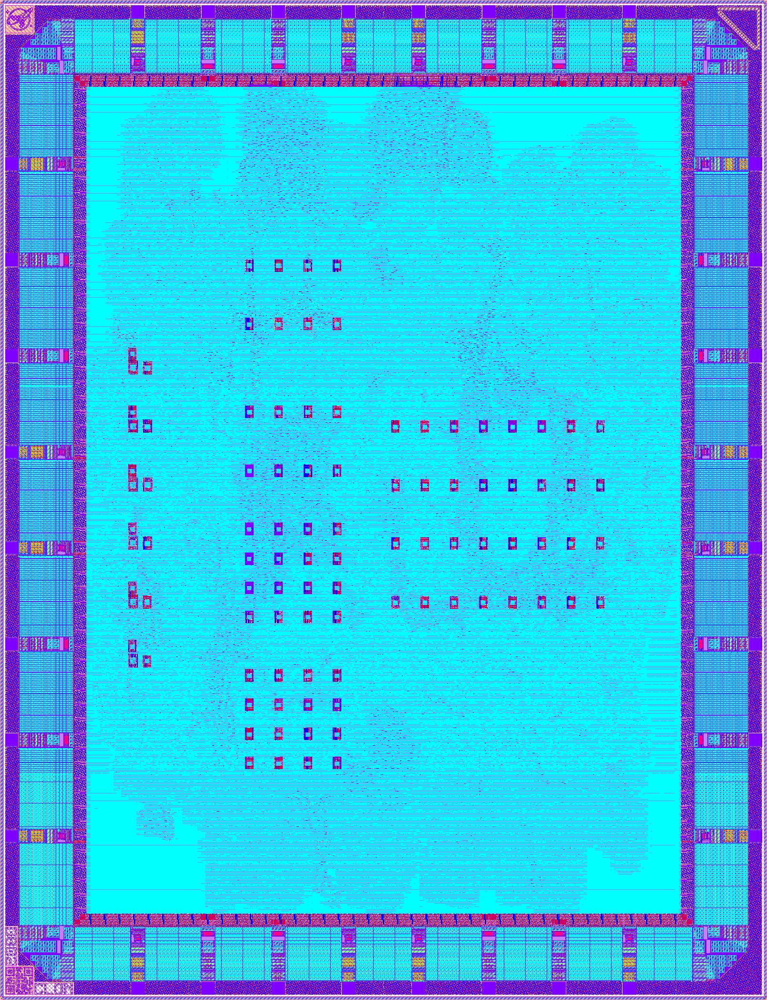

# Cloneless2
Cloneless2 is the second in a series of tamper-resistant cryptographic open-source silicon designs, following its predecessor [Cloneless1](https://github.com/ThorbenMoos/Cloneless1). It is built from GlobalFoundries' 180nm open-source PDK [GF180MCU](https://gf180mcu-pdk.readthedocs.io/en/latest), the [wafer.space](https://wafer.space) [project template](https://github.com/wafer-space/gf180mcu-project-template) and is being manufactured via [wafer.space GF180MCU Run 2](https://www.crowdsupply.com/wafer-space/gf180mcu-run-2). The Cloneless2 ASIC has been designed using the [librelane](https://librelane.readthedocs.io/en/latest) EDA tool flow and can be fully and easily reproduced from the sources and scripts provided in this repository.

## Updates since Cloneless1
Cloneless2 brings several technical novelties. Concrete scientific details are referenced further down this document, this is a high-level overview:
- The protected block cipher implementation now satisfies provable glitch+transition-robust probing security that can be formally verified using state-of-the-art toolchains. This is a stronger security guarantee than the (non-verified beyond squaring gadget) glitch-robustness of Cloneless1.
- Existing ES-TRNG and RO-PUF instances have been tuned based on first measurement results from Cloneless1 silicon. For the TRNGs, the carry4-based tapped delay chain for jitter sampling has been completely replaced by a buffer-based one to achieve higher resolution measurements.
- A new family of PUF cells has been introduced for key storage and characterization, namely butterfly PUFs constructed from two cross-coupled latches per cell. Their design principle with automated routing and placement relies on assumptions regarding low-level cell properties that remain to be verified in silicon.
- For convience of practical security evaluation, a trigger signal has been routed to an IO cell. Additionally, a second hard-coded key has been integrated for selection to enable clean fixed-vs-fixed key measurements.  



## (Re-)Producing the Chip Design
After cloning the repository (```git clone https://github.com/ThorbenMoos/Cloneless2```) and performing a short environment setup, (re-)producing the entire chip design with all its intermediate stages and files should be as easy as a single call to the Makefile. To have that work, make sure to install [ghdl](https://github.com/ghdl/ghdl), [iverilog (Icarus Verilog)](https://github.com/steveicarus/iverilog), the make utility and the [nix](https://github.com/NixOS/nix) package manager. On Ubuntu Server 26.04 LTS the following commands have been tested for installing these utilities:

```
sudo apt update
sudo apt install -y ghdl
sudo apt install -y verilog
sudo apt install -y build-essential
curl --proto '=https' --tlsv1.2 -fsSL https://artifacts.nixos.org/nix-installer | sh -s -- install --no-confirm --extra-conf "
    extra-substituters = https://nix-cache.fossi-foundation.org
    extra-trusted-public-keys = nix-cache.fossi-foundation.org:3+K59iFwXqKsL7BNu6Guy0v+uTlwsxYQxjspXzqLYQs=
    extra-experimental-features = nix-command flakes
"
. /nix/var/nix/profiles/default/etc/profile.d/nix-daemon.sh
```

Once these steps are completed, ```nix-shell``` can be opened in the main directory of this repository. Inside the shell simply call ```make all``` and wait for the result. The Makefile verifies testbenches, converts the sources, clones the PDK and executes the librelane flow, first to pre-harden some macros and then to implement the overall chip design. Finally, the [wafer.space precheck](https://github.com/wafer-space/gf180mcu-precheck is executed to complete the sign-off procedure and confirm manufacturability. On a 16-core machine with 32 GB memory, the overall runtime should be 12-13 hours, about 5:30h for the initial flow and 7h for the precheck. If everything goes well, the design should pass all testbenches as well as the Antenna, DRC and LVS checks, both in the initial flow and the precheck.

For reference you may download the [final GDS](https://thorbenmoos.de/Cloneless2.gds.zip) (zip, 53 MB) and [postlayout netlist](https://thorbenmoos.de/Cloneless2.nl.v.zip) (zip, 7 MB) here to compare your results against. KLayout Diff/XOR should report no differences between the provided GDS file and the one produced by the flow described above. Careful, regular checksums are not adequate for comparing GDS files.

## RTL Design
The RTL design is fully written in VHDL, all sources are located in the ```src``` folder. Many high-level modules make use of generics to keep the designs parametrizable and useful beyond their concrete instantiation in this project. Conversion from VHDL to Verilog for compatibility with the EDA tool is performed with ghdl.

## Science and Cryptography
The Cloneless2 design implements and/or leverages the following scientific results and cryptographic primitives:

- The mid-pSquare block cipher [1] which is an instance of the Feistel for Prime Masking (FPM) family of tweakable block ciphers [2].
- Inner-product masking over a Mersenne prime field, combining results of [3], [4] and [5] for both side-channel and fault resistance.
- The arbitrary-order masked and trivially composable gadgets for squaring proposed in [6].
- The pipelining strategy of [7] to achieve glitch+transition-robust probing security from glitch-robust gadgets.
- The formal verification flow of [8] to verify prime-field masked gadgets and full implementations.
- Duplication with redundant error checks for fault resistance.
- The Edge-Sampling based True Random Number Generator (ES-TRNG) [9] for seed generation.
- The Trivium stream cipher [10] for concurrent pseudo-randomness generation from the initial seed as recommended in [11].
- Ring-Oscillator based Physically Unclonable Functions (RO-PUFs) [12] for technology characterization.
- Butterfly based Physically Unclonable Functions (BF-PUFs) [13] for characterization and to generate private key material.

The mid-pSquare cipher implementation uses two shares and two redundancy domains. Raw outputs of some exemplary TRNG and PUF designs with different parametrization are accessible via the framework. Error-corrected TRNG and PUF outputs used for key and randomness generation are not accessible via the interface.

[1]: https://doi.org/10.46586/tches.v2025.i4.486-519, https://github.com/uclcrypto/mid-pSquare  
[2]: https://doi.org/10.1007/978-3-031-58734-4_7, https://github.com/uclcrypto/small-pSquare  
[3]: https://doi.org/10.1007/978-3-031-30634-1_20  
[4]: https://doi.org/10.46586/tches.v2024.i4.690-736  
[5]: https://doi.org/10.1007/978-981-95-5096-8_17  
[6]: https://doi.org/10.46586/tches.v2023.i2.482-518, https://github.com/uclcrypto/prime_field_masking_hardware  
[7]: https://doi.org/10.46586/tches.v2021.i2.136-158  
[8]: https://doi.org/10.46586/tches.v2026.i3.1310-1336, https://github.com/uclcrypto/prime_masking_verification  
[9]: https://doi.org/10.13154/tches.v2018.i3.267-292  
[10]: https://doi.org/10.1007/11836810_13  
[11]: https://doi.org/10.62056/akdkp2fgx, https://github.com/uclcrypto/randomness_for_hardware_masking  
[12]: https://doi.org/10.1145/1278480.1278484  
[13]: https://doi.org/10.1109/HST.2008.4559053  

## Functionality and Purpose
Equivalent to Cloneless1, the Cloneless2 chip encrypts plaintexts with the mid-pSquare block cipher and outputs the respective ciphertexts. It is designed to do so without revealing intermediate computation results to physical adversaries. Two independent cryptographic keys are hardcoded in shared form and identical for all samples of the chip. The third cryptographic key that can be selected via the configuration registers derives some entropy from error-corrected BF-PUF responses and should be different between any two chip samples. The purpose of the design is to provide an open and verifiable test target for all kinds of physical attack research. In particular, it is designed to empirically evaluate the effectiveness of the employed combination of protection mechanisms. Furthermore, the raw PUF and TRNG responses that are accessible via the toplevel interface are meant for characterization of oscillator behavior in the technology to determine proper parametrization for future iterations in the Cloneless series. Finally, the design is meant to experimentally evaluate whether the combination of leakage-resilient secret sharing and tamper-evident delay-based PUFs can become a viable protection against invasive physical adversaries without relying on obscurity or obfuscation.

## Disclaimer
This is our second attempt at using fully open-source EDA tools and PDKs to build a tamper-resistant cryptographic ASIC. While the cryptography, science and high-level design principles should be sound (see the referenced peer-reviewed articles), it is possible, even likely, that the low-level implementation contains flaws that will affect the functionality and/or intended security properties. The plan is to discover such mistakes, report them and learn from them in the open, instead of behind closed doors as typically done in cryptographic IC design. As is, the design is not concretely useful beyond research purposes, as the chip aims at experimental verification of the physical security properties instead of providing full end-to-end security. The design and documentation target research-level quality and [TRL](https://en.wikipedia.org/wiki/Technology_readiness_level) 3.

## Acknowledgement
This work has been supported by the [PBS Foundation](https://pbs.foundation) via Project SOVereign.